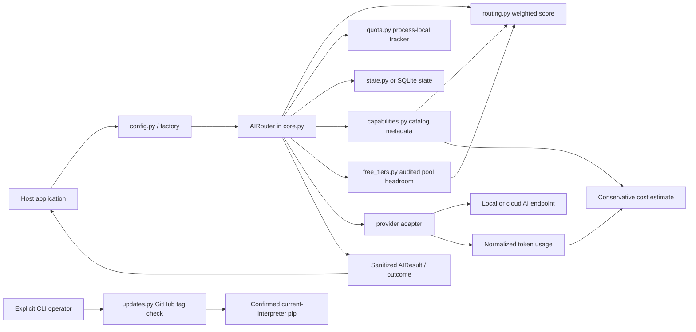
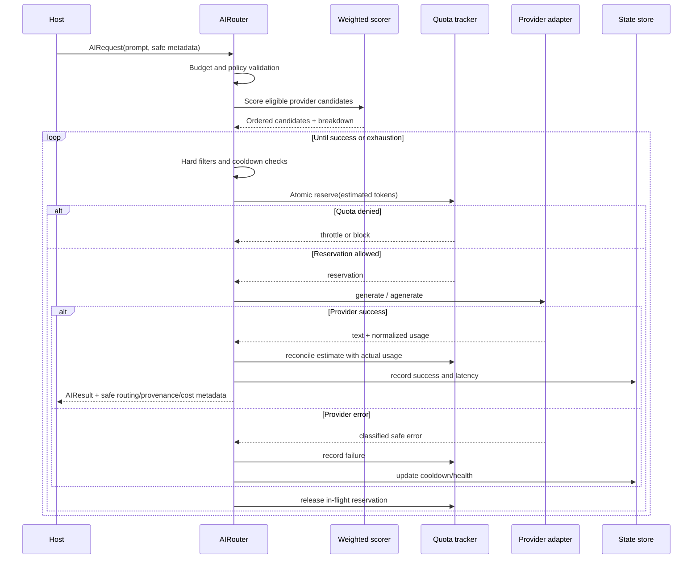
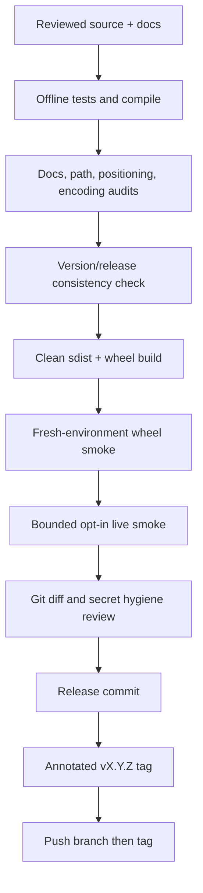

# System Architecture and Handoff Map

Nakazasen AI Router is a library-first Python capacity layer. A host application submits an `AIRequest`; the router applies hard policy gates, ranks eligible candidates, enforces process-local quota policy, invokes one provider adapter, then returns a sanitized `AIResult` or durable route outcome.

Vietnamese readers can use this document together with [README.vi.md](README.vi.md). Release operations are standardized in [docs/releasing.md](docs/releasing.md) and [docs/releasing.vi.md](docs/releasing.vi.md).

## Design boundaries

The router owns:

- provider, model, and masked-key candidate selection;
- explainable weighted ordering and fallback;
- health, cooldown, and process-local quota decisions;
- normalized token usage, catalog provenance, conservative cost estimates, and audited free-tier reporting;
- opt-in version awareness and explicit, confirmed package update commands;
- sanitized outcomes, snapshots, and operational state.

The host application owns:

- prompt/payload persistence and domain validation;
- privacy classification and consent;
- secret management and API-key rotation;
- package pin/update policy for its own environment;
- business budgets, provider-reported balances, billing truth, and distributed quota coordination;
- retry scheduling around durable route outcomes.

> **Important:** `InMemoryQuotaTracker` is thread-safe but **process-local**. Shared pools coordinate router instances only when they use the same tracker object in one Python process. Multi-process or distributed deployments need an external atomic quota backend; this project does not claim distributed quota enforcement.

## Repository map

```text
nakazasen-ai-router/
├── src/nakazasen_ai_router/       # Installable SDK
│   ├── core.py                    # Requests, results, providers, sync/async router lifecycle
│   ├── routing.py                 # Mode packs, normalized weights, score breakdown
│   ├── quota.py                   # Shared pools, fixed windows, reservations, headroom
│   ├── capabilities.py            # Catalog metadata, provenance, token/cost normalization
│   ├── free_tiers.py              # Auditable plans, pool deduplication, budget math
│   ├── free_tier_catalog.py       # Conservative built-in provider free-tier evidence
│   ├── updates.py / cli.py        # Opt-in release checks and explicit update/report commands
│   ├── config.py                  # Environment-driven composition and dependency injection
│   ├── registry.py                # Built-in provider endpoint/model definitions
│   ├── discovery.py               # Opt-in startup catalog refresh
│   ├── providers/                 # Provider adapters; OpenAI-compatible is the main transport
│   ├── state.py                   # In-memory/JSON candidate health state
│   ├── storage_sqlite.py          # SQLite state implementation
│   ├── jobs.py                    # Durable job queue contracts
│   ├── segmentation.py            # Generic segmented workload helpers
│   ├── metrics.py / scoreboard.py # Sanitized operational views
│   └── __init__.py                # Deliberate public SDK exports
├── tests/                         # Offline regression and public-contract tests
├── scripts/                       # Audits, live smoke, discovery, install/release checks
├── examples/                      # Offline integrations and static prototypes
├── docs/                          # Integration, release, provider, and design guidance
├── .github/workflows/             # CI gates
├── pyproject.toml                 # Build metadata and authoritative package version
├── CHANGELOG.md                   # User-visible version history
└── ARCHITECTURE.md                # This handoff document
```

Generated `build/`, `dist/`, `*.egg-info`, caches, local virtual environments, `.env*`, and `API Key.txt` are not source artifacts and must not be committed.

## Component model



### Core composition

- `create_router_from_env()` is the standard assembly boundary. It accepts explicit environment mappings, networking opt-in, state configuration, and an injectable quota tracker.
- `AIRouter` contains routing lifecycle policy. Keep sync `route()` and async `aroute()` behavior aligned.
- `ProviderBase` and `ProviderCandidate` are extension points. A candidate key identifier is masked before it enters router metadata.
- `OpenAICompatibleProvider` builds chat-completion requests and only retains normalized, safe response metadata.

## Routing lifecycle



### Hard constraints versus weighted preferences

Hard constraints always win and must not be weakened by scoring:

- budget rejection;
- `local_only`;
- allowed and avoided providers;
- last-resort partitioning;
- disabled provider/capacity profiles;
- provider, model, and key cooldowns;
- quota block/throttle decisions.

Eligible candidates are ordered by explainable weighted signals:

- task/capability fit;
- historical success health;
- latency;
- capability cost tier;
- quota headroom;
- free-tier headroom in `cheap` and `quota` modes only;
- static priority.

Built-in mode packs are `balanced`, `fast`, `cheap`, `quality`, and `quota`. Callers may inject custom `ScoreWeights`. Every successful result includes the chosen mode, total score, and component signals; these values contain no prompt or raw key. Free-tier preference is never a policy exemption.

## Quota and capacity model

`InMemoryQuotaTracker` matches profiles from most to least specific:

1. `provider + model + key_id`
2. `provider + model`
3. `provider`

Profiles may share a `pool_id`. Shared profiles consume one usage bucket, so related models or keys draw from common request/token capacity. All profiles in one pool should use compatible limits because enforcement uses the matched profile policy against shared usage.

Supported controls include:

- requests/tokens per minute;
- requests per Unix epoch day;
- maximum in-flight requests;
- named fixed windows with request/token limits;
- reservation, release, success/failure recording;
- estimated-to-actual token reconciliation;
- quota headroom for routing preference.

Flexible windows are **fixed windows**, not rolling/sliding windows. `snapshot()` labels its scope as `process_local`.

## Catalog provenance and accounting

`ModelCapability` carries safe model metadata plus optional:

- input/output price per million tokens and currency;
- quota pool identifier;
- source URL;
- verification timestamp;
- confidence and terms note.

Provider adapters normalize common OpenAI and Gemini usage shapes into `TokenUsage`. Raw provider response payloads are not retained. `estimate_cost()` reports `estimated` only when verified input/output prices and the corresponding usage split are available. Otherwise it returns `unknown`; the router never invents pricing or token splits.

Cost metadata is operational guidance, not a provider invoice. Host applications remain responsible for billing reconciliation and budget authority.

## Free-tier catalog and local usage scope

`FreeTierPlan` separates fixed recurring allowance, signup credit, and dynamic/unlimited status. A numeric monthly headline requires current source URL, verification date, confidence, and fixed token/period data. Plans sharing `pool_id` are counted once using the conservative minimum allowance. Card/top-up gated, terms-flagged, stale, uncertain, or incomplete plans do not receive routing preference.

`AIRouter` records normalized successful tokens against a process-local period bucket for the matched free-tier pool. Reports are labeled `estimated_local`; restarts, other processes, other applications, and provider-side traffic are not visible. Provider dashboards remain authoritative. The built-in catalog intentionally reports zero numeric recurring monthly capacity until reproducible fixed grants exist.

## Safe update subsystem

`updates.py` performs no network access unless `enable_network=True`. The CLI is the only built-in apply surface: it checks tags, prints an exact `sys.executable -m pip` command targeting an immutable tag, and requires confirmation unless `--yes` is deliberately supplied. Import, router construction, and route lifecycles never invoke the checker or pip. Consumer repositories should use reviewable Dependabot/Renovate PRs for automation.

## State, privacy, and failure behavior

The router records operational data only: masked candidate IDs, classifications, retry timing, latency, and counters. It must not persist or expose:

- raw API keys or Authorization headers;
- prompts in state/attempt records;
- raw provider responses;
- secret-bearing exception text.

Provider failures are classified into safe categories such as auth, quota/rate limit, timeout, and provider 5xx. Candidate fallback continues where policy permits. `route_outcome()` and `aroute_outcome()` expose non-throwing `success`, `retry_later`, or `failed` outcomes for durable workers.

## Startup catalog refresh

`discovery.py` is explicit opt-in. Gemini uses its native catalog endpoint with `X-Goog-Api-Key`; other cloud providers use OpenAI-compatible `GET /models`. Discovered chat-capable IDs are merged ahead of static fallback models only for that provider instance. Failures preserve static defaults and do not block startup.

## Extension ownership guide

| Change | Primary file(s) | Required companion work |
|---|---|---|
| New routing signal or mode | `routing.py`, `core.py` | unit tests, score metadata docs, sync/async parity |
| New quota rule/backend | `quota.py`, `config.py` | atomicity tests, scope semantics, snapshot safety |
| New capability/provenance field | `capabilities.py` | defaulted compatibility, accounting tests, API docs |
| New OpenAI-compatible provider | `registry.py`, provider docs | aliases, mock tests, optional bounded live smoke |
| Non-compatible provider protocol | new file in `providers/` | injected transport, sanitized errors/usage, sync/async tests |
| New public SDK symbol | `__init__.py` | `docs/public_api.md`, `tests/test_public_api.py`, changelog |
| State schema change | `state.py` / `storage_sqlite.py` | migration/compatibility and secret-leak tests |
| Release/version change | `pyproject.toml`, changelog, release note, READMEs | `scripts/release_check.py`, build/install gates, tag |

### Rules for human and AI contributors

1. Read `ARCHITECTURE.md`, `docs/public_api.md`, and relevant tests before editing core behavior.
2. Preserve public positional constructor compatibility by appending defaulted dataclass fields.
3. Keep provider networking dependency-injected and opt-in.
4. Make the smallest coherent change; do not add gateway, dashboard, OAuth, or distributed systems by implication.
5. Maintain sync/async parity and `finally`-based reservation release.
6. Add regression tests before release; offline tests must not need real credentials.
7. Never read, print, stage, copy, or commit local credential files.

## Verification and release flow



See [docs/releasing.md](docs/releasing.md) for commands, failure handling, and required release evidence.
